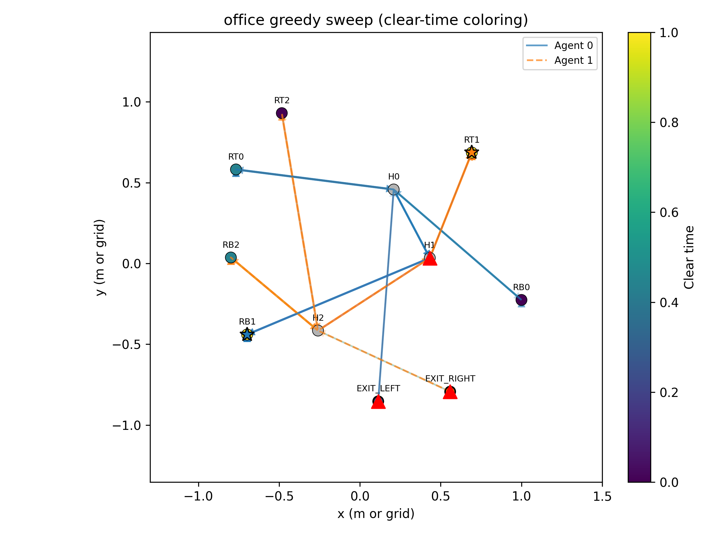
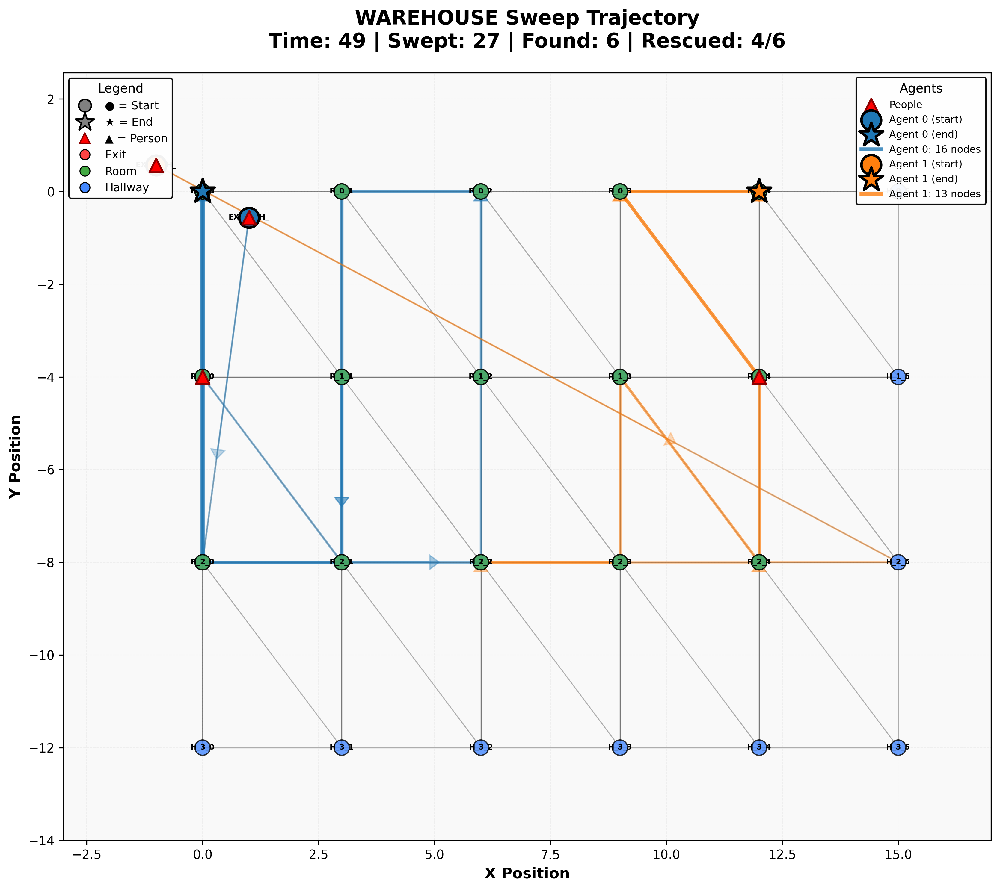

# GoHiMCM - Multi-Agent Fire Evacuation

When a fire breaks out in a building, every second counts. Firefighters must search rooms, locate people, coordinate with their team, and avoid dangerous conditions at the same time. This project uses AI to study and improve that process.

GoHiMCM is a research framework for coordinating multiple firefighter agents during building evacuations, using deep reinforcement learning and graph neural networks. In practice, it simulates thousands of evacuation scenarios and lets agents learn effective strategies over time.

---

## What This Project Does

Consider a firefighter entering a burning building. They can only see what is directly around them, but they still need to:
- Search every room for trapped people
- Guide civilians to safety
- Avoid fire and smoke
- Coordinate with your team
- Do all this as fast as possible

This is a challenging planning problem. Traditional algorithms often use simple greedy strategies such as "go to the nearest unsearched room", which can miss important global structure. Here, we compare that style of planner to learned policies that improve through experience.

## Two Ways to Solve It

We implemented two methods so you can see the difference:

**1. Traditional Planner** (Baseline)
- A risk-aware greedy algorithm that scores rooms based on distance, risk, and congestion
- Simple, fast, and easy to interpret
- Uses the scoring rule: `Score = α·distance - β·risk + γ·congestion`

**2. RL-Based Approach** (Learned Policy)
- Uses Graph Attention Networks + PPO (a standard deep RL method)
- Learns long-horizon strategies through trial and error
- Naturally handles partial visibility (agents cannot see the whole building)
- Can discover coordination patterns that were not hand‑coded


*Traditional greedy planner navigating an office building*


*Performance on large warehouse scenario*

---

## What the System Provides

### The Simulation
The framework includes a realistic fire environment with:
- Buildings represented as graphs (rooms connected by hallways)
- Fire and smoke that spread probabilistically
- Panicked civilians trying to escape
- Multi-floor buildings with stairs and exits
- Partial visibility—agents only know what they've seen

### The Intelligence
The learning agents use:
- **Graph Attention Networks** to understand building layouts
- **PPO (Proximal Policy Optimization)** to learn evacuation strategies
- **Curriculum learning**—we train them on easy scenarios first, then harder ones
- **Multi-agent coordination**—they learn to work as a team

---


## How It Works

The system has three main pieces:

**1. The Environment** (`src/environment/`)
   - Simulates buildings, fire dynamics, and people
   - Converts everything into graph format that AI can understand
   - Tracks agent positions, search progress, and rescue outcomes

**2. The Traditional Planner** (`src/traditional_planner/`)
   - Smart greedy algorithm for comparison
   - Scores rooms based on: distance to agent, fire risk, how crowded the path is
   - Simple but effective baseline

**3. The RL Agents** (`src/rl/`)
   - Graph neural networks that understand building layouts
   - PPO algorithm that learns through trial and error
   - Reward system that encourages exploration, rescues, and efficiency
   - Trained progressively on harder scenarios

---

---

## Getting Started

### Requirements

- Python 3.8+
- 16 GB RAM recommended
- For training: NVIDIA GPU with 8 GB+ VRAM
- For quick tests and visualization: CPU is sufficient

### Installation

```bash
# 1. Clone this repo
git clone https://github.com/TigerQu/GoHiMCM.git
cd GoHiMCM

# 2. Set up environment
conda create -n fire python=3.10
conda activate fire

# 3. Install dependencies
pip install torch torchvision --index-url https://download.pytorch.org/whl/cu118
pip install torch-geometric torch-scatter torch-sparse
pip install networkx numpy matplotlib pandas tensorboard

# 4. Quick sanity check
python src/scripts/smoke_test.py
```

---

---

## Quick Start

### Try the Traditional Planner First

This is fast and doesn't need a GPU:

```bash
# See how the greedy algorithm performs
cd src/traditional_planner
python sweep_all_layouts.py

# Tune the parameters yourself
python alpha_sweep_experiment.py --layout office
```

### Train RL Agents

You can start with simpler scenarios and then move to more complex ones:

```bash
# Easy: Office building (2 agents, ~30 min)
python src/rl/train_phase2_daycare.py --agents 2 --iterations 500

# Medium: Daycare (3 agents, ~2 hours)
python src/rl/train_phase2_daycare.py --agents 3 --iterations 1000

# Hard: Warehouse (4 agents, ~6 hours)
python src/rl/train_phase3_warehouse.py --agents 4 --iterations 2000
```

### Visualize the Results

```bash
# Watch your trained agents in action
python src/rl/visualize_agent_trajectories.py \
    --scenario warehouse \
    --checkpoint logs/phase3_warehouse_*/checkpoints/best_model.pt \
    --episodes 5

# Monitor training in real-time
tensorboard --logdir logs/
```

---

---

## Project Structure

Here's what's where:

```
GoHiMCM/
├── src/
│   ├── environment/          # The simulation
│   │   ├── env.py           # Main environment
│   │   ├── layouts.py       # Building designs (office, daycare, warehouse)
│   │   ├── hazards.py       # Fire and smoke spread
│   │   └── occupants.py     # Civilian evacuation behavior
│   │
│   ├── traditional_planner/ # The baseline method
│   │   ├── planner.py       # Greedy algorithm
│   │   ├── scoring.py       # How it scores rooms
│   │   └── sweep_all_layouts.py  # Test it
│   │
│   ├── rl/                  # The AI approach
│   │   ├── new_gat.py       # Graph neural network
│   │   ├── new_ppo.py       # Learning algorithm
│   │   ├── train_phase2_daycare.py    # Train on daycare
│   │   ├── train_phase3_warehouse.py  # Train on warehouse
│   │   └── visualize_agent_trajectories.py  # Watch agents move
│   │
│   └── scripts/             # Useful tools
│       ├── smoke_test.py    # Quick test
│       └── visualize_layouts.py  # See building layouts
│
├── experiments/             # Parameter tuning experiments
├── paper_figures/          # All generated plots
├── logs/                   # Training logs
└── legacy/                 # Old code (kept for reference)
```

---

## Scenarios

Agents are trained and evaluated on three progressively harder building types:

**Office (Easy)**
- Single floor, 8 rooms, 2 agents
- Focus on basic exploration and coordination

**Daycare (Medium)**  
- 3 floors, 18 nurseries, 3 agents
- Focus on rescuing vulnerable occupants and handling stairs

**Warehouse (Hard)**
- 2 floors, large grid, 4 agents  
- Focus on full coverage and team coordination

---

## Questions

This repository was originally developed for the HiMCM 2025 competition and then cleaned up for reuse. To explore further:

- Inspect the core code under `src/`
- Review parameter experiments in `experiments/`
- Check `legacy/` for historical scripts and detailed internal notes

GitHub: [TigerQu/GoHiMCM](https://github.com/TigerQu/GoHiMCM)

---

*Built with PyTorch, NetworkX, and a lot of iteration.*